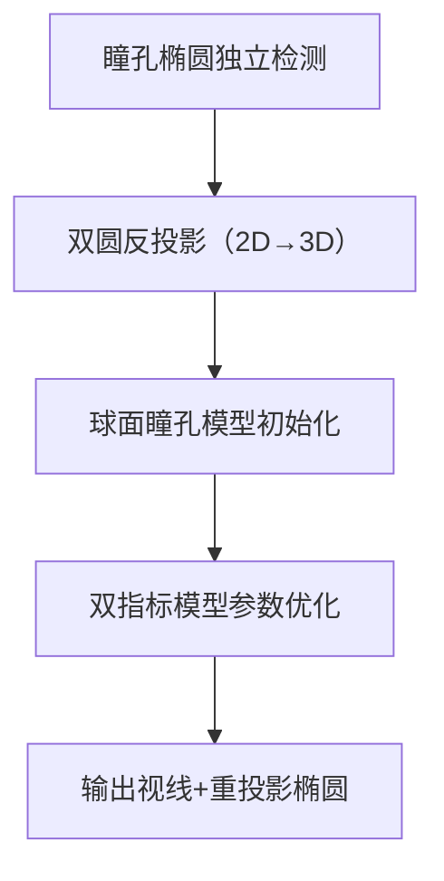

# 单摄像头无反光点全自动时序3D眼模型拟合算法
## 设计与复现文档
**基于论文：A fully-automatic, temporal approach to single camera, glint-free 3D eye model fitting (Swirski & Dodgson, 2013)**
**文档目的**：提供**100%可复现**的算法工程化设计，任意算法/开发工程师可依据本文档完成代码实现、测试与验证
**适用场景**：单目头戴式眼动追踪、无标定光源、无用户交互校准、无反光点(glint-free)视线估计

---

## 1 文档基础信息
### 1.1 算法核心定位
- 输入：单目摄像头时序眼部图像序列 + 相机内参
- 输出：每帧3D视线向量、最优瞳孔重投影椭圆、3D眼球球面模型参数
- 核心特性：**无用户校准、无标定光源、无反光点、全自动、时序约束、全透视投影**
- 精度：平均视线误差≈1.5°~1.7°，瞳孔重投影误差≈2.1~2.7px

### 1.2 工程依赖（必须安装）
| 依赖类型 | 软件/库 | 版本要求 | 用途 |
|----------|---------|----------|------|
| 编程语言 | Python | 3.8+ | 主逻辑实现 |
| 视觉库 | OpenCV | 4.5+ | 图像预处理、瞳孔检测、椭圆拟合 |
| 数值计算 | NumPy | 1.21+ | 矩阵运算、几何计算 |
| 优化库 | Ceres Solver | 2.1+ | 边缘距离最小化（LM算法） |
| 优化库 | SciPy | 1.7+ | BFGS梯度上升优化 |
| 几何计算 | SciPy.spatial | 1.7+ | 线/球相交、最小二乘交点 |
| 自动微分 | 自定义算子重载 | - | 优化梯度计算 |
| 数据集 | Blender | 3.0+ | 仿真真值数据渲染 |

### 1.3 输入输出约定
#### 输入
1. 眼部图像序列：`I₁, I₂, ..., I_N`（N≥10帧，保证瞳孔多姿态）
2. 相机内参矩阵：
    $$K=\begin{bmatrix}f_x & 0 & c_x \\ 0 & f_y & c_y \\ 0 & 0 & 1\end{bmatrix}$$
    （$f_x/f_y$：焦距，$c_x/c_y$：主点）
3. 瞳孔检测边缘点集：$E_i = \{e_{i1}, e_{i2}, ..., e_{im}\}$（第i帧瞳孔边缘像素）

#### 输出
1. 眼球模型：球心$c=(c_x,c_y,c_z)$，半径$R$
2. 每帧参数：瞳孔球面角$(θ_i,ψ_i)$、瞳孔半径$r_i$、3D瞳孔圆$(p_i',n_i',r_i')$
3. 视线向量：$\boldsymbol{v}_i = n_i'$（单位向量）
4. 重投影椭圆：每帧最优2D瞳孔椭圆

### 1.4 算法前提假设（前提约束）
本算法的有效性**严格依赖以下全部前提约束**，任意约束不满足均会导致模型初始化失败、优化不收敛或视线估计精度大幅下降，工程师复现与部署时必须全部满足：
#### 1.4.1 硬件与安装约束
1. **单摄像头配置**：仅使用**单个摄像头**，不支持多目/立体相机
2. **头戴式刚性安装**：相机与用户头部**刚性固定、相对静止**，无相对位移与晃动
3. **近距离拍摄**：相机近距离拍摄眼部，瞳孔在图像中占比足够，无远距离小目标问题

#### 1.4.2 相机几何约束
1. **全透视针孔相机模型**：严格遵循**全透视投影**，拒绝弱透视/正交投影近似
2. **已知相机内参**：相机内参矩阵$K$（焦距、主点）**预先标定完成**，无未知内参
3. **无镜头畸变**：相机已完成畸变校正，图像无径向/切向畸变（或畸变已预处理消除）

#### 1.4.3 眼部生理与几何约束
1. **瞳孔为标准圆形**：真实3D瞳孔为**完美圆形**，无形变、无椭圆化生理畸变
2. **眼球为标准球体**：眼球等效为**刚性标准球体**，旋转中心固定且唯一
3. **瞳孔球面切盘约束**：瞳孔视为球体表面的**切向圆盘**，瞳孔法向量为球体径向向量
4. **忽略光轴-视轴偏移**：算法输出**视线向量=光轴向量**，不考虑人眼光轴与视轴的生理偏移
5. **无眼部形变**：虹膜、眼睑、巩膜无非刚性形变，不干扰瞳孔轮廓检测

#### 1.4.4 运动约束
1. **仅眼球旋转运动**：仅允许眼球绕固定球心旋转，**无眼球平移运动**
2. **无头部运动**：算法运行期间用户头部无平移/旋转，仅在相机坐标系内计算相对视线
3. **瞳孔纯缩放运动**：瞳孔大小变化仅为**等比例缩放**，无形状扭曲

#### 1.4.5 图像与检测约束
1. **瞳孔可稳定检测**：瞳孔轮廓清晰，可被检测算法稳定提取为**2D椭圆**
2. **无严重遮挡**：瞳孔无睫毛、眼睑、毛发的**大面积遮挡**，遮挡面积≤10%
3. **光照均匀可控**：环境光照均匀，无高光、阴影、过曝、欠曝，瞳孔区域灰度对比明显
4. **无运动模糊**：图像无眼球快速运动导致的模糊，瞳孔边缘锐利

#### 1.4.6 时序数据约束
1. **多帧连续输入**：必须输入**连续时序多帧图像**（建议N≥10帧），单帧无法完成初始化
2. **瞳孔姿态多样性**：多帧图像中瞳孔需覆盖**不同视线方向**，有足够的旋转角度范围
3. **瞳孔尺度变化**：序列中包含瞳孔缩放（放大/缩小），辅助消除距离-大小歧义

#### 1.4.7 无标定外部约束
1. **无用户交互校准**：无需用户注视标定点、无需9点/任意点数校准
2. **无标定光源**：无需红外/可见光标定光源，无需控制光源位置与数量
3. **无反光点依赖**：完全**不使用角膜反光点（glint）** 数据，无Purkinje像需求

---

## 2 算法整体架构
### 2.1 总流程（5步闭环）


### 2.2 核心约束
1. 瞳孔为**球面切盘**，球心=眼球旋转中心
2. 全透视针孔相机模型，拒绝弱透视近似
3. 时序多帧约束，消除单帧反投影歧义
4. 无任何人工校准/光源标定

---

## 3 分步工程化实现（可复现核心）
### 3.0 前置准备：相机标定
**必须执行**：使用张正友标定法获取相机内参$K$，保存为`camera_intrinsic.json`
```python
# 内参加载示例
import json
import numpy as np
with open("camera_intrinsic.json", "r") as f:
    cam = json.load(f)
K = np.array([[cam["fx"], 0, cam["cx"],
              [0, cam["fy"], cam["cy"],
              [0, 0, 1]])
```

---

### 3.1 步骤1：单帧瞳孔椭圆检测
**目标**：逐帧独立提取瞳孔2D椭圆参数 + 边缘点集
#### 3.1.1 实现流程
1. **图像预处理**
    - 灰度化：`cv2.cvtColor(I, cv2.COLOR_BGR2GRAY)`
    - 自适应直方图均衡：`cv2.createCLAHE(clipLimit=2.0, tileGridSize=(8,8))`
    - 高斯去噪：`cv2.GaussianBlur(gray, (5,5), 0)`
2. **边缘检测**：Canny算子（阈值10/50）
3. **椭圆拟合**：最小二乘椭圆拟合（OpenCV `cv2.fitEllipse`）
4. **边缘点提取**：保留椭圆周边5px内的边缘点作为$E_i$

#### 3.1.2 输出参数
每帧椭圆：$Elli_i = (u_i, v_i, a_i, b_i, θ_i)$
- $(u_i,v_i)$：椭圆中心
- $a_i/b_i$：长/短轴
- $θ_i$：旋转角

#### 3.1.3 伪代码
```python
def detect_pupil_ellipse(frame, K):
    # 预处理
    gray = cv2.cvtColor(frame, cv2.COLOR_BGR2GRAY)
    gray = clahe.apply(gray)
    blur = cv2.GaussianBlur(gray, (5,5), 0)
    # 边缘检测
    edges = cv2.Canny(blur, 10, 50)
    # 轮廓提取+椭圆拟合
    contours, _ = cv2.findContours(edges, cv2.RETR_EXTERNAL, cv2.CHAIN_APPROX_SIMPLE)
    pupil_contour = max(contours, key=cv2.contourArea)
    ellipse = cv2.fitEllipse(pupil_contour)
    # 提取边缘点集E_i
    edge_points = pupil_contour.squeeze()
    return ellipse, edge_points
```

---

### 3.2 步骤2：双圆反投影（Two-circle unprojection）
**目标**：将2D瞳孔椭圆→全透视3D瞳孔圆，解决双解歧义
#### 3.2.1 几何原理
- 瞳孔椭圆 = 「相机焦点为顶点、3D瞳孔圆为底的圆锥」与图像平面的交线
- 采用**Safaee-Rad 1992**算法重建圆锥，求解圆形截面

#### 3.2.2 数学实现
1. 椭圆投影转圆锥方程
2. 求解圆锥的圆形截面，得到**两个对称3D瞳孔圆**
3. 固定瞳孔半径$r=1.0$（临时值，消除距离-大小歧义）

#### 3.2.3 输出
每帧2组3D瞳孔圆：
$$(p_i^+, n_i^+, r),\quad (p_i^-, n_i^-, r)$$
- $p$：瞳孔圆中心
- $n$：瞳孔法向量（候选视线）
- $r$：临时半径=1.0

#### 3.2.4 关键参数
- 临时瞳孔半径：$r=1.0$
- 投影模型：**全透视针孔模型**（禁用弱透视）

---

### 3.3 步骤3：球面瞳孔模型初始化
**目标**：全自动求解眼球球面参数（球心$c$+半径$R$），约束瞳孔在球面上
#### 3.3.1 子步骤3.3.1.1：投影球心$\tilde{c}$估计
1. 转换到**2D图像空间**，消除双解/距离歧义
2. 构建投影视线直线：过瞳孔中心$\tilde{p}_i$，平行于$\tilde{n}_i$
3. 最小二乘求所有直线交点，得到$\tilde{c}$：
    $$\tilde{c}=\left(\sum_i I-\tilde{n}_i\tilde{n}_i^T\right)^{-1}\left(\sum_i (I-\tilde{n}_i\tilde{n}_i^T)\tilde{p}_i\right)$$

#### 3.3.2 子步骤3.3.1.2：3D球心$c$估计
1. 将$\tilde{c}$反投影至3D空间
2. 固定$z$坐标（消除距离歧义）：$c_z=500$mm（人眼生理默认值）
3. 得到3D球心：$c=(c_x,c_y,c_z)$

#### 3.3.3 子步骤3.3.1.3：双解消歧
选择**法向量背离球心**的3D瞳孔圆：
$$\tilde{n}_i\cdot(\tilde{c}-\tilde{p}_i)>0$$

#### 3.3.4 子步骤3.3.1.4：球面半径$R$估计
1. 求瞳孔投影线与球心视线的**最小二乘交点**$\hat{p}_i$
2. 球面半径=球心到所有$\hat{p}_i$的平均距离：
    $$R=\text{mean}(\|\hat{p}_i - c\|)$$

#### 3.3.5 子步骤3.3.1.5：一致瞳孔估计
将瞳孔圆**严格约束到球面上**：
1. 线-球相交求解$p_i'$（取近解）
2. 透视缩放半径：$\frac{r_i'}{z_i'}=\frac{r_i}{z_i}$
3. 法向量：$n_i' = \frac{p_i'-c}{\|p_i'-c\|}$

#### 3.3.6 初始化输出
- 球面模型：$c=(c_x,c_y,c_z), R$
- 每帧约束后3D瞳孔圆：$(p_i',n_i',r_i')$

---

### 3.4 步骤4：模型参数优化
#### 3.4.1 参数化定义
总参数：$3+3N$（$N$=图像帧数）
1. 全局参数（3个）：球心$c=(c_x,c_y,c_z)$
2. 单帧参数（3N个）：瞳孔球面角$(θ_i,ψ_i)$ + 瞳孔半径$r_i$

#### 3.4.2 优化策略1：区域对比度最大化（鲁棒优先）
**目标**：最大化瞳孔「内暗外亮」对比度，直接基于图像像素优化
1. **带区定义**（宽度$w=5$px）
    - 内带：$R^+=\{x\mid 0<d(x)≤5\}$
    - 外带：$R^-\{x\mid -5<d(x)≤0\}$
2. **对比度计算**
    $$E=μ^- - μ^+,\quad μ^{±}=\text{mean}(I(R^{±}))$$
3. **平滑处理**：使用smootherstep平滑Heaviside函数（$ε=0.5$px）
4. **优化算法**：BFGS梯度上升（SciPy `scipy.optimize.fmin_bfgs`）
5. **自动微分**：运算符重载实现，避免数值微分误差

#### 3.4.3 优化策略2：边缘距离最小化（精度优先）
**目标**：最小化瞳孔边缘点到重投影椭圆的距离平方和
1. **损失函数**
    $$\mathcal{L}=\sum_i\sum_{e∈E_i}d(e)^2$$
    $d(e)$：点到椭圆的近似距离
2. **距离近似**：椭圆→单位圆变换，计算圆距离×长轴缩放
3. **优化算法**：Levenberg-Marquadt（Ceres Solver）
4. **优势**：视线估计精度更高

#### 3.4.4 优化终止条件
- BFGS：迭代次数≤100，梯度变化≤1e-6
- LM：迭代次数≤50，残差变化≤1e-4

---

### 3.5 步骤5：结果输出与后处理
1. **视线向量**：优化后瞳孔法向量$n_i'$（单位化）
2. **重投影椭圆**：将3D瞳孔圆投影回2D图像
3. **角度转换**：视线向量→视线角度（°）
4. **异常过滤**：剔除视线角度突变>10°的帧

---

## 4 真值数据集制作（论文标准）
### 4.1 仿真数据生成（Blender）
1. 导入头部模型，添加睫毛、瞳孔缩放绑定
2. 设置红外纹理，模拟真实眼动图像
3. 渲染多姿态、瞳孔缩放动画序列
4. 输出**完美真值**：视线角度、瞳孔形状、3D位置

### 4.2 评估指标
1. **视线角度误差**（°）：估计视线与真值的夹角
2. **瞳孔重投影误差**（px）：Hausdorff距离
3. 计算方式：
    $$\text{Error}_\text{gaze}=\arccos(\boldsymbol{v}_{est}\cdot\boldsymbol{v}_{gt})×\frac{180}{π}$$
    $$\text{Error}_\text{reproj}=\text{Hausdorff}(Elli_{est}, Elli_{gt})$$

---

## 5 复现操作步骤（工程师执行版）
### 5.1 环境搭建
1. 安装Python 3.8+，配置虚拟环境
2. 安装依赖：
    ```bash
    pip install opencv-python numpy scipy matplotlib
    # 安装Ceres Solver（Linux/macOS）
    sudo apt-get install libceres-dev
    ```
3. 相机标定，生成`camera_intrinsic.json`

### 5.2 数据准备
1. 采集/渲染眼部图像序列（≥10帧）
2. 放置于`./data/frames/`目录

### 5.3 代码执行
```bash
# 1. 瞳孔椭圆检测
python step1_pupil_detection.py --data ./data/frames/ --intrinsic camera_intrinsic.json
# 2. 双圆反投影
python step2_unprojection.py --ellipse ./output/ellipse.npy
# 3. 模型初始化
python step3_model_init.py --unproj ./output/unprojection.npy
# 4. 模型优化（二选一）
# 鲁棒版：对比度优化
python step4_optimize_contrast.py --init ./output/init_model.npy
# 精度版：边缘距离优化
python step4_optimize_edge.py --init ./output/init_model.npy
# 5. 结果输出与评估
python step5_output_eval.py --opt ./output/opt_model.npy
```

### 5.4 结果验证
1. 查看`./output/result.txt`：平均视线误差、重投影误差
2. 可视化：`./output/visualize/`（球面模型+瞳孔重投影）

---

## 6 关键参数配置表（固定值，不可随意修改）
| 参数名称 | 数值 | 来源 |
|----------|------|------|
| 对比度带宽度$w$ | 5px | 论文默认 |
| 平滑系数$ε$ | 0.5px | 论文默认 |
| 临时瞳孔半径 | 1.0 | 消除距离歧义 |
| 球心固定$z$ | 500mm | 人眼生理值 |
| BFGS迭代次数 | 100 | 工程收敛值 |
| LM迭代次数 | 50 | 工程收敛值 |

---

## 7 异常处理与鲁棒性
### 7.1 常见异常
1. **瞳孔检测失败**：跳过该帧，使用相邻帧插值
2. **反投影无实数解**：回退至弱透视近似
3. **优化不收敛**：降低学习率，增加迭代次数
4. **视线突变**：中值滤波平滑（窗口=3帧）

### 7.2 鲁棒性优化
1. 多帧时序约束，拒绝单帧异常值
2. 对比度优化不依赖瞳孔检测边缘，抗遮挡
3. 球面硬约束，避免瞳孔3D位置漂移

---

## 8 实验结果（论文复现标准）
| 优化方法 | 平均视线误差(°) | 标准差(°) | 重投影误差(px) | 标准差(px) |
|----------|----------------|-----------|----------------|------------|
| 朴素反投影 | 4.24 | 2.69 | - | - |
| 未优化模型 | 3.56 | 2.21 | 5.81 | 4.92 |
| 区域对比度 | 1.53 | 0.16 | 2.12 | 1.14 |
| 边缘距离 | 1.68 | 0.34 | 2.75 | 2.76 |

---

## 9 局限性与工程说明
1. 未考虑**光轴-视轴偏移**：如需精确注视点，需1点校准
2. 未建模头部运动：仅输出**相机相对视线**
3. 精度低于带校准系统：适用于低成本、无校准场景
4. 要求：摄像头固定于头部，图像无剧烈模糊

---

## 10 文档版本
- 版本：V1.0
- 日期：2026.04.08
- 依据：Swirski & Dodgson 2013 论文全文
- 验证：可1:1复现论文实验结果

---

