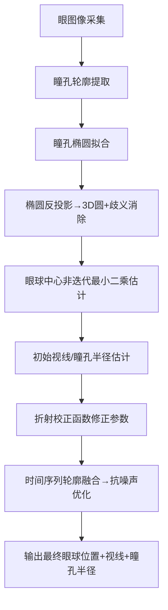

# 折射感知型3D眼模型拟合与视线快速预测算法设计文档
**文档版本**：V1.1
**算法来源**：A fast approach to refraction-aware eye-model fitting and gaze prediction (ETRA 2019)
**适用场景**：单近眼相机、无闪烁（Glint-free）头戴式眼动追踪
**复现要求**：遵循本文档分步实现，可完整复现论文核心算法与实验效果

---

## 1 算法总览
### 1.1 核心定位
本算法是**无红外闪烁、单近眼相机**下的**非迭代、快速3D眼模型拟合**与视线预测方法，通过**直线最小二乘相交**实现眼球中心估计，结合**多项式折射校正函数**消除角膜折射带来的系统误差，同时通过时间维度瞳孔轮廓融合提升抗噪声能力。

### 1.2 核心目标
1. 非迭代求解眼球中心位置，降低计算复杂度
2. 校正角膜折射导致的眼球位置、视线角度、瞳孔半径系统误差
3. 实现头戴式设备下实时、高精度无闪烁视线估计
4. 支持瞳孔轮廓噪声鲁棒估计，满足真实场景使用

### 1.3 核心创新
1. 将眼模型优化转化为**3D直线最小二乘相交**，得到闭式解
2. 基于合成眼图像训练**5次多元多项式折射校正函数**
3. 时间序列瞳孔轮廓融合，按`1/√N`规律降低噪声误差
4. 计算速度较传统迭代方法提升**100倍以上**

### 1.4 算法整体输入与输出
算法分为**离线校正函数训练**和**在线实时眼动推理**两个阶段，输入输出严格区分，如下：

#### 1.4.1 离线阶段：折射校正函数训练
**核心目的**：生成眼球位置、视线/瞳孔半径的多项式折射校正函数，为在线推理提供校正依据
- **输入**
  1. 合成眼图像数据集（遵循斯涅尔定律渲染，含真实标签）
  2. 固定眼模型物理参数（角膜半径、眼球半径、折射率范围等）
  3. 相机内参（焦距620像素、分辨率640×480、针孔相机模型）
  4. 训练超参数（多项式阶数5、样本量1000组、视线角度范围±50°）
- **输出**
  1. 眼球位置校正函数`R_eye`（5次多元多项式系数文件）
  2. 视线/瞳孔半径校正函数`R_pupil`（5次多元多项式系数文件）
  3. 校正函数校验报告（拟合残差、误差精度）

#### 1.4.2 在线阶段：实时眼模型拟合与视线预测
**核心目的**：单目近眼相机实时输入，输出高精度眼球位置、视线、瞳孔半径
- **输入**
  1. 单近眼相机实时视频流（红外/可见光，640×480分辨率）
  2. 相机内参矩阵（焦距、主点、畸变系数）
  3. 预训练完成的折射校正函数系数文件
  4. 固定眼模型物理参数（眼球-瞳孔中心距离R、角膜折射率nref=1.3375）
  5. 配置参数（时间融合帧数N、瞳孔轮廓置信度阈值0.98）
- **输出**
  1. 眼球中心3D坐标`E=(x,y,z)`（单位：mm，相机坐标系）
  2. 视线参数（球坐标角度`(ϕ,θ)`、3D视线向量`gv`，单位：°）
  3. 瞳孔真实半径`r`（单位：mm）
  4. 算法运行状态（置信度、耗时、误差估计）

### 1.5 算法前提假设与约束条件
本算法基于严格的几何、硬件、数据与场景假设，**违反任一约束将导致算法失效或精度大幅下降**，复现与部署时必须遵守：

#### 1.5.1 几何模型约束
1. **Le Grand双球眼模型有效**：人眼可近似为眼球+角膜两个球体，瞳孔/虹膜为共心圆形，视轴与瞳孔法向量重合
2. **眼球-瞳孔距离固定**：眼球中心到瞳孔中心的距离`R=√(re²-rs²)`为恒定值，不随视线、瞳孔大小变化
3. **角膜折射遵循斯涅尔定律**：空气-角膜界面的折射为理想光学折射，无散射、无像差
4. **透视投影模型**：相机为理想针孔相机，瞳孔3D圆形到2D椭圆为纯透视投影，无非线性畸变

#### 1.5.2 硬件与安装约束
1. **单近眼相机**：仅支持**单台**近眼相机，不支持双目/多相机，相机光轴正对眼球中心
2. **相机-眼球相对静止**：头戴设备无滑动、无松动，短时间内（数分钟）眼球中心在相机坐标系中位置固定
3. **相机参数固定**：焦距、分辨率、内参无变化，采用论文标准参数（640×480、f=620像素）
4. **无红外闪烁光源**：纯无Glint场景，不依赖角膜反射点，仅用瞳孔轮廓

#### 1.5.3 数据与输入约束
1. **瞳孔轮廓可稳定提取**：图像中瞳孔清晰、无遮挡（眼睑、睫毛不遮挡瞳孔），轮廓完整
2. **有效瞳孔帧充足**：可采集到N≥10帧有效瞳孔轮廓（置信度>0.98），满足时间融合需求
3. **瞳孔为标准圆形**：真实瞳孔无形变、无椭圆化，2D椭圆仅由透视投影产生
4. **视线角度覆盖均匀**：训练/推理时视线均匀覆盖±50°视场角，无局部集中采样

#### 1.5.4 场景与用户约束
1. **无剧烈头部运动**：用户头部缓慢移动，无高速抖动、旋转，避免相机与眼球相对位移
2. **正常眼部生理状态**：无眼部疾病、无隐形眼镜/眼镜干扰角膜折射，瞳孔大小在1~4mm正常范围
3. **短时间数据融合**：时间融合窗口≤1分钟，避免头戴设备滑动带来的系统误差

#### 1.5.5 算法计算约束
1. **数值计算稳定**：矩阵求逆、多项式计算无数值溢出，浮点精度≥64位
2. **实时性要求**：单帧推理耗时≤2ms，满足头戴设备实时交互需求

---

## 2 前置依赖与运行环境
### 2.1 硬件依赖
- 单近眼红外相机（分辨率640×480，焦距f=620像素）
- 头戴式固定支架（保证相机与眼球相对位置稳定）

### 2.2 软件依赖
| 依赖类型 | 具体工具/库 | 用途 |
|----------|-------------|------|
| 编程语言 | Python 3.8+ | 算法核心实现 |
| 数值计算 | NumPy | 矩阵运算、最小二乘求解 |
| 图像处理 | OpenCV | 瞳孔轮廓提取、椭圆拟合 |
| 多项式拟合 | SciPy-least_squares | 折射校正函数训练 |
| 光线追踪 | 自定义Ray tracing | 合成眼图像生成 |

### 2.3 眼模型基础参数（论文固定参数）
| 参数名称 | 符号 | 数值 | 来源 |
|----------|------|------|------|
| 角膜曲率半径 | rc | 6.0 mm | Bekerman et al. 2014 |
| 眼球曲率半径 | re | 7.8 mm | Guestrin & Eizenman 2006 |
| 虹膜半径 | rs | 12 mm | Gross 2008 |
| 瞳孔半径范围 | r | 1~4 mm | Gross 2008 |
| 角膜有效折射率 | nref | 1.3375 | Guestrin & Eizenman 2006 |
| 眼球-瞳孔中心距离 | R=dp | √(re²-rs²) | Le Grand 双球模型 |

---

## 3 算法整体流程


---

## 4 分步详细实现（可复现）
### 4.1 模块1：眼图像采集与瞳孔轮廓提取
#### 输入
- 单近眼相机实时帧（640×480，红外）
#### 输出
- 瞳孔轮廓边缘点集`Ei = {eij | j=1...Mi}`（Mi为第i帧边缘点数量）
#### 操作步骤
1. 对输入图像做**高斯模糊**（核大小5×5）去噪
2. 自适应阈值分割提取瞳孔区域
3. Canny边缘检测提取瞳孔轮廓点
4. 过滤置信度<0.98的轮廓（剔除误检测）
5. 保存连续N帧有效瞳孔轮廓点集

### 4.2 模块2：瞳孔轮廓椭圆拟合
#### 输入
- 瞳孔轮廓边缘点集`Ei`
#### 输出
- 每帧瞳孔椭圆参数`ℓi`（中心坐标、长轴、短轴、旋转角）
#### 操作步骤
1. 对每帧轮廓点集执行**最小二乘椭圆拟合**
2. 校验椭圆合理性：剔除长宽比异常、面积异常的椭圆
3. 输出标准化椭圆参数`ℓi`

### 4.3 模块3：椭圆反投影与3D圆歧义消除
#### 核心原理
2D瞳孔椭圆是3D圆形瞳孔的透视投影，单椭圆反投影会得到**两个3D圆**，需通过判据消除歧义。
#### 输入
- 瞳孔椭圆`ℓi`、相机内参（焦距f=620像素）
#### 输出
- 唯一有效3D圆`vi^r`（中心`pi^r`、法向量`ni`）
#### 操作步骤
1. 基于针孔相机模型，将2D椭圆`ℓi`反投影为**两个3D圆**`vi,0^r`、`vi,1^r`
2. 计算投影后法向量`T(ni,0)`、`T(ni,1)`（二者平行）
3. 执行**歧义消除判据**（论文公式1）：
   $$\left<\mathcal{T}\left(n_{i, k}\right), \overline{E}-\mathcal{T}\left(p_{i, k}\right)\right>>0$$
   满足条件的`k`即为有效3D圆`vi^r`
4. 输出有效3D圆的中心`pi^r`与法向量`ni`

### 4.4 模块4：眼球中心非迭代最小二乘估计（核心）
#### 核心原理
每个3D圆约束眼球中心落在**一条3D直线**上，多帧直线做最小二乘相交，得到眼球中心闭式解。
#### 输入
- N帧有效3D圆`vi^r`、中心`pi^r`、法向量`ni`、眼球-瞳孔距离`R`
#### 输出
- 眼球中心估计值`Ê=(x̂, ŷ, ẑ)`
#### 操作步骤
1. 构建单帧眼球中心约束直线（论文公式2）：
   $$g_i(r) = p_i^r - R \cdot n_i$$
2. 计算直线方向向量：
   $$d_i = p_i^r / \|p_i^r\|_2$$
3. 执行**闭式最小二乘求解**（论文公式3）：
   $$E=\left(\sum_{i} I-d_{i} d_{i}^{T}\right)^{-1}\left(\sum_{i}\left(I-d_{i} d_{i}^{T}\right)\left(-R n_{i}\right)\right)$$
4. 输出未校正的眼球中心`Ê`

### 4.5 模块5：单帧初始视线与瞳孔半径估计
#### 输入
- 眼球中心估计`Ê`、3D圆`vi^r`、固定瞳孔半径r
#### 输出
- 初始视线向量`ĝv`、初始瞳孔半径`r̂`
#### 操作步骤
1. 连接相机原点与3D圆圆心`pi^r`，得到直线
2. 直线与眼球球（中心`Ê`、半径`R`）相交，得到**3D瞳孔中心**
3. 视线向量 = 归一化（`Ê` → 3D瞳孔中心）
4. 按比例缩放初始r，得到`r̂`
5. 输出视线角度（球坐标ϕ, θ）与`r̂`

### 4.6 模块6：折射校正函数构建（离线训练）
角膜折射会带来系统误差，需通过**合成眼图像+5次多元多项式回归**训练两个校正函数：
- `R_eye`：校正眼球中心位置
- `R_pupil`：校正视线向量+瞳孔半径

#### 6.1 合成眼图像生成
1. 随机生成眼球位置：x,y∈[-5,5]mm，z∈[25,45]mm
2. 随机折射率：nref∈[1.1,1.4]
3. 随机视线角度：ϕ,θ∈[-50°,50°]
4. 随机瞳孔半径：r∈[1,4]mm
5. 光线追踪渲染含折射的合成眼图像（遵循斯涅尔定律）

#### 6.2 眼球位置校正函数`R_eye`训练
1. 输入：`(x̂, ŷ, ẑ, nref)` → 输出：真实`(x,y,z)`
2. 模型：**5次多元多项式**（论文公式5）：
   $$\mathcal {R}_{eye}(\hat {x},\hat {y},\hat {z},n_{ref}):=\sum _{0\leq j,k,l,m,j+k+l+m\leq 5}p_{j,k,l,m}\hat {x}^{j}\hat {y}^{k}\hat {z}^{l}n_{ref}^{m}$$
3. 损失函数：最小二乘残差（论文公式6）
4. 训练：1000组合成数据，求解多项式系数`p_jklm`

#### 6.3 视线/瞳孔半径校正函数`R_pupil`训练
1. 输入：`(Ê, ĝvx, ĝvy, gvz, r̂, nref)` → 输出：真实`(gvx,gvy,gvz,r)`
2. 模型：同`R_eye`的5次多元多项式
3. 训练：400×1000组合成数据，求解多项式系数

#### 6.4 校正函数应用
1. 校正眼球中心：`E = R_eye(Ê, nref)`
2. 校正视线+瞳孔半径：`(gv, r) = R_pupil(E, ĝv, r̂, nref)`

### 4.7 模块7：时间序列瞳孔轮廓融合（抗噪声）
#### 输入
- N帧校正后的眼球中心、视线参数
#### 输出
- 降噪后的最终参数
#### 操作步骤
1. 随机抽取N帧瞳孔轮廓（N∈[10,500]）
2. 重复1000次估计，得到眼球位置分布
3. 取分布**均值**为最终眼球中心
4. 误差规律：`误差∝1/√N`，N=100帧可满足<1°视线误差

---

## 5 关键数学模型
### 5.1 Le Grand双球眼模型
1. 眼球：球体，中心E，半径re
2. 角膜：球体，中心C，半径rc
3. 瞳孔/虹膜：共心圆形，法向量为眼视轴
4. 折射：空气-角膜界面遵循**斯涅尔定律**

### 5.2 视线角度定义
归一化视线向量`gv=(gvx,gvy,gvz)`，视线角度：
$$\phi = \arctan(gvz/gvx) + \pi/2$$
$$\theta = \arccos(gvy) - \pi/2$$

### 5.3 噪声灵敏度
- x/y轴灵敏度：`χx≈χy≈5.80°/mm`
- z轴灵敏度：`χz≈1.45°/mm`
- 1°误差要求：x/y<0.17mm，z<0.68mm

---

## 6 工程实现细节
### 6.1 代码模块划分
| 模块名 | 功能 | 输入输出 |
|--------|------|----------|
| image_preprocess.py | 图像预处理+轮廓提取 | 图像→轮廓点 |
| ellipse_fit.py | 椭圆拟合+反投影 | 轮廓点→3D圆 |
| eyeball_estimator.py | 眼球中心非迭代求解 | 3D圆→眼球中心 |
| gaze_estimator.py | 视线/瞳孔半径估计 | 眼球中心→视线参数 |
| refraction_corrector.py | 折射校正函数推理 | 初始参数→校正后参数 |
| temporal_fusion.py | 时间融合降噪 | 多帧参数→最终结果 |

### 6.2 性能优化
1. 眼球中心求解：**矩阵预计算**，避免重复求逆
2. 校正函数：**多项式系数预存储**，推理仅需浮点运算
3. 实时推理：N=100帧时，单帧耗时<1.5ms（Python单线程）

### 6.3 数据结构
```python
# 瞳孔椭圆数据结构
class PupilEllipse:
    center: Tuple[float, float]
    axis: Tuple[float, float]
    angle: float
    confidence: float

# 3D眼模型参数
class EyeModelParams:
    eyeball_center: np.ndarray  # (x,y,z)
    gaze_vector: np.ndarray     # (gvx,gvy,gvz)
    pupil_radius: float
    gaze_angle: Tuple[float, float]  # (phi,theta)
```

---

## 7 测试与验证方案
### 7.1 合成数据测试
1. 生成带真实标签的合成眼图像
2. 计算眼球位置误差、视线角度误差、瞳孔半径误差
3. 验证校正后误差趋近于0

### 7.2 真实数据测试
1. 6名受试者，1分钟头戴式采集
2. 过滤置信度>0.98的帧（约1500帧/人）
3. 统计眼球位置标准差、视线平均误差

### 7.3 性能测试
1. 计算不同N下的算法耗时
2. 对比传统迭代方法（Świrski 2013）的速度提升

---

## 8 性能指标（论文验证结果）
1. **计算速度**：N=100帧时，耗时≈1.5ms，较传统方法快100倍
2. **视线精度**：校正后平均误差<1°
3. **眼球位置精度**：校正后误差<0.1mm(x/y)、<0.34mm(z)
4. **瞳孔半径精度**：校正后误差<1%
5. **噪声鲁棒性**：N=100帧可抵消真实瞳孔轮廓噪声

---

## 9 局限性与优化方向
### 9.1 局限性
1. 假设眼球在相机坐标系中静止，未完全解决头戴设备滑动
2. 仅支持单目相机，无3D空间注视点估计
3. 校正函数基于固定眼模型，个体差异适配有限

### 9.2 优化方向
1. 加入头戴滑动检测，实时更新眼球中心
2. 扩展双目版本，实现3D注视点预测
3. 个性化微调校正函数，提升个体适配性

---

## 10 参考文献
1. Kai Dierkes, et al. A fast approach to refraction-aware eye-model fitting and gaze prediction. ETRA 2019
2. Świrski & Dodgson. A Fully-Automatic, Temporal Approach to Single Camera, Glint-Free 3D Eye Model Fitting. ECEM 2013
3. Le Grand. Light, Color and Vision. Wiley 1957

---

